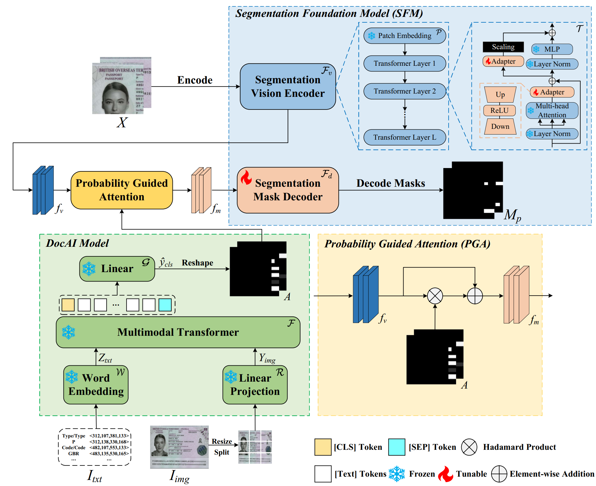

# DocAI-TL
DocAI-TL: Structured Document Tampering Localization with DocAI Model



## Requirments

For environment setup, please follow the [SAM-Adapter installation](https://github.com/tianrun-chen/SAM-Adapter-PyTorch/blob/main/requirements.txt).

## Dataset
The T-CERT, T-FUNSD and tampered receipts from T-IDR are publicly available. However, ID cards cannot be shared due to licensing restrictions.

You can download the above datasets [here](https://pan.baidu.com/s/18UNBbFuBINNDsERSeSrzyg)   🔑Extraction code: `nzis`

## DocAI pretrained weight
You can download the DocAI (LayoutLMv3, LayoutLMv2, and LiLT) pretrained weight [here](https://pan.baidu.com/s/1TnmtEzcdGPcb7Gv_CdefFg)  🔑Extraction code: `ntxy`

## SAM model weight
You can download the weights of SAM ViT-L and SAM-Adapter [here](https://pan.baidu.com/s/1GOypB9BHTooIWZNr0FneNQ)   🔑Extraction code: `g88u`

## Train
Run the training command.
```
CUDA_VISIBLE_DEVICES=xx python -m torch.distributed.launch --nnodes x --nproc_per_node x train.py  --config configs/Multimodal_sam-vit-l-adapter.yaml --name experimental_name --tag exp1 
```

## Test
```
--config
save/experimental_name/config.yaml
--model
save/experimental_name/weight.pth
--save_name
xx
--csv_path
csv/Certificate_Text_Tampering_Probs_Layoutlmv3.csv
```

## Acknowledgements

We would like to express our sincere gratitude to the authors of the SAM-Adapter project for their invaluable contributions. The open-source code provided by the SAM-Adapter team has been instrumental in the development of this project. 

Special thanks to the SAM-Adapter team for their dedication to advancing research and providing a robust foundation for others to build upon. You can find their work here: [SAM-Adapter GitHub](https://github.com/tianrun-chen/SAM-Adapter-PyTorch/tree/main).
